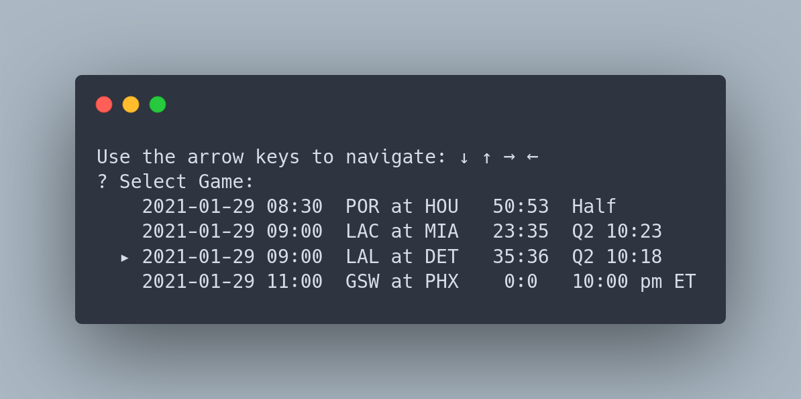
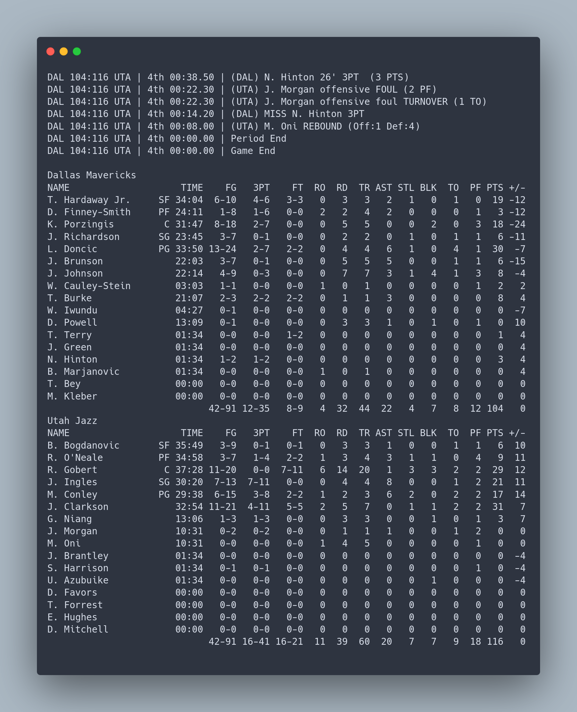

# Features
- Auto refresh in play by play mode. 自動更新文字轉播。
- Show boxscore at timeout (for players on court) and period change (full box). 暫停與每節結束時顯示boxscore。
- Timezone default to system time. 

# Screenshot 程式畫面

# Installation 安裝
## With binary
Download prebuilt binaries of your desired OS from [Github Releases](https://github.com/aljohn0422/nbacli/releases/tag/v1.0). Unzip the binary.

- **On Windows**, double click to run `nba.exe` application.

- **On Mac or Linux**, `cd` into the directory and run `./nba`; or drag the file into your terminal to run.

從[Github Releases](https://github.com/aljohn0422/nbacli/releases/tag/v1.0)下載符合作業系統的檔案，並且解壓縮。

- **Windows系統**：直接雙擊`nba.exe`執行程式。

- **Mac或是Linux系統**：開啟終端機、`cd`到檔案位置執行`./nba`，或是將檔案拖拉到終端機畫面中執行。
## Build from source
    git clone https://github.com/aljohn0422/nbacli/
    cd nbacli

    # dependencies
    go get github.com/manifoldco/promptui
    go build -o nba .
    ./nba

## Build with Dockerfile
    git clone https://github.com/aljohn0422/nbacli/
    cd nbacli
    docker build -t nbacli .
    docker run -it nbacli
